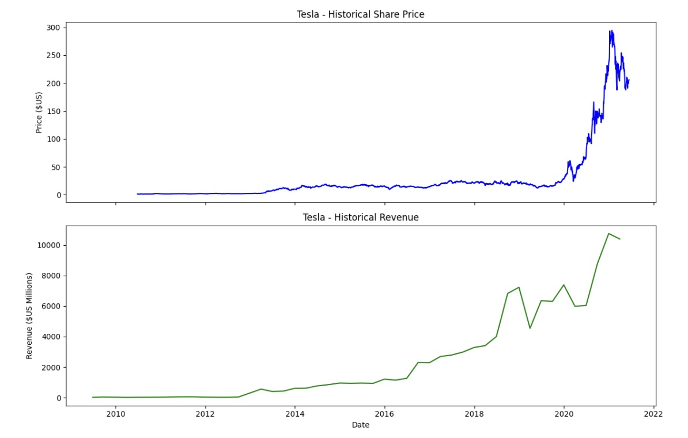
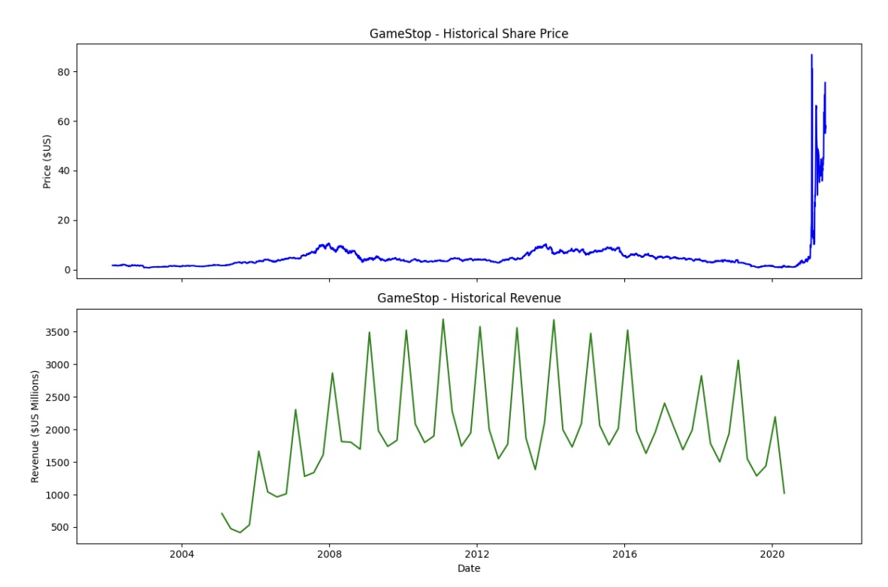

# Stock Market Analysis and Revenue Trends Dashboard

## 📘 Project Context

This project was completed as part of the IBM Data Science Professional Certificate. It focuses on extracting, analyzing, and visualizing financial data to support investment decision-making.

## 🎯 Objective

To collect historical stock price data and quarterly revenue data for selected companies, clean and process the data, and create visualizations to identify trends and patterns.

## 📊 Companies Analyzed

* Tesla (TSLA)
* GameStop (GME)

## 🛠️ Tools and Technologies

* Python
* pandas
* yfinance
* BeautifulSoup (bs4)
* requests
* matplotlib

## 🔍 Key Tasks Performed

* Extracted stock data using the yfinance API
* Scraped revenue data from web sources using BeautifulSoup
* Cleaned and transformed raw data for analysis
* Converted date fields to datetime format for time-series analysis
* Visualized stock prices and revenue trends using matplotlib

## 📈 Results & Insights

* Identified relationships between stock prices and company revenue
* Observed consistent growth patterns in companies like Tesla and Amazon
* Detected irregular spikes in GameStop stock prices, indicating market anomalies

## 📁 Project Structure

* `stock_analysis_dashboard.ipynb` → Main notebook containing all code and visualizations

## 📊 Tesla Stock vs Revenue

## 📊 GameStop Stock vs Revenue

## 📈 Key Insights

### Tesla (TSLA)

* Tesla shows a strong upward trend in both stock price and revenue, especially after 2020
* Revenue growth is consistent and aligns closely with the increase in stock price
* This indicates that Tesla’s stock performance is driven by strong business fundamentals and expansion

### GameStop (GME)

* GameStop’s stock price remains relatively stable for years but shows a sharp spike around 2021
* Revenue does not show a corresponding increase and remains mostly flat or declining
* This suggests that the stock surge is driven by external market factors rather than company performance

### 📊 Overall Comparison

* Tesla demonstrates **fundamentally driven growth**, where stock price reflects revenue performance
* GameStop exhibits **speculative behavior**, where stock price movements are not supported by financial data

### 🧠 Conclusion

Tesla represents a company with strong business growth reflected in its stock performance, while GameStop highlights how market dynamics can drive stock prices independently of company fundamentals.

## 📌 Notes

* Data is limited to the time range available from the sources used
* Graphs are generated using matplotlib for compatibility with submission requirements

## 👤 Author

Sumit
IBM Data Science Professional Certificate (Course Project)
